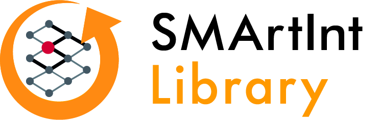

This is the new home for the library. The old repository with double ii is still available [here](https://github.com/xrg-simulation/SMArtIInt).

The **SMArtInt Library** is designed to integrate various artificial intelligence (AI) models seamlessly into Modelica-based simulation tools. **SMArtInt**, short for **S**imple **M**odelica **Art**ificial **I**ntelligence I**nt**erface, provides a user-friendly interface that bridges advanced AI capabilities with the power of Modelica simulations, enhancing both modeling efficiency and simulation accuracy.

Currently, it supports the following tools
1. Dymola
2. OpenModelica

with 

1. TensorFlow models exported as TFLite
2. ONNX models.

The repository contains a compiled version of the interface for usage in windows. __As a starting point open the Modelica Library. It contains some ready to run examples (SMartInt.Tester) which demonstrate the usage.__ The corresponding python files which create the TF-Lite and ONNX models are located in Resources\ExampleNeuralNets.

Hints for usage in Dymola:
Currently, only a 64-bit version is available. If the variable Advanced.CompileWith64 is set on its default value 0, Dymola will automatically compile a 64-bit Dymosim.exe after giving a remark in the translate log file. In case Advanced.CompileWith64=2 a 64-bit dymosim.exe is created anyway and in case of Advanced.CompileWith64=1 compilation will fail.

SMArtInt uses other software - the source code is included as submodule and/or as compiled version for direct usage_
1. Tensorflow (https://github.com/tensorflow/tensorflow)
* License: https://github.com/tensorflow/tensorflow/blob/master/LICENSE
2. Bazel.exe (https://github.com/bazelbuild/bazel)
* License: https://github.com/bazelbuild/bazel/blob/master/LICENSE
3. ClaRa Delay (https://github.com/xrg-simulation/ClaRaDelay)
* License: https://github.com/xrg-simulation/ClaRaDelay/blob/main/LICENSE
4. ONNX Runtime (https://github.com/microsoft/onnxruntime)
* License: https://github.com/microsoft/onnxruntime/blob/main/LICENSE

This work was carried out within the framework of the research project DIZPROVI, supported by the Federal Ministry of Education and Research (number 03WIR0105E).
